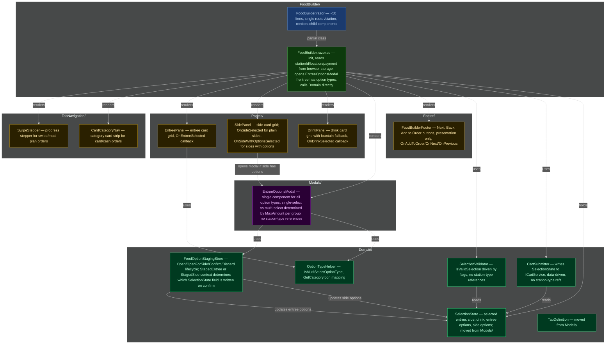

# Stations Refactoring Gameplan

## Current Architecture (before Phase 1)

The diagram below shows every file inside `Components/Pages/Stations/` and how they related to one another before any refactoring. ⚠ marks classes that lock us into hard-coded station types and would need to change every time a new station is added.

```mermaid
%%{init: {'theme': 'dark'}}%%
graph TB
    classDef page     fill:#1a3a6e,stroke:#5588cc,color:#d0e8ff
    classDef cb       fill:#0d3a0d,stroke:#44aa44,color:#ccffcc
    classDef vm       fill:#3a2000,stroke:#cc8833,color:#ffe8bb
    classDef strategy fill:#2a0a4a,stroke:#8855cc,color:#eebbff
    classDef config   fill:#3a0a0a,stroke:#cc4444,color:#ffbbbb
    classDef model    fill:#003a3a,stroke:#33aaaa,color:#bbffff
    classDef factory  fill:#2a2a00,stroke:#aaaa33,color:#ffffbb

    subgraph gswipe["GenericSwipe/"]
        GS["GenericSwipe.razor — 847 lines, 5 station-specific blocks, 5 modals, 6 hard-coded routes"]:::page
        GSCS["GenericSwipe.razor.cs — 671 lines, duplicated sandwich/wrap staging, duplicated IsXxxComplete methods"]:::cb
        VM["GenericSwipeVM — delegates selection, validation, and cart logic to active ISelectionStrategy"]:::vm
        IVM["IGenericSwipeVM — view model interface"]:::vm
    end

    subgraph strats["Strategies/"]
        ISTR["ISelectionStrategy — 15-method interface"]:::strategy
        BASE["BaseSelectionStrategy — shared cart helpers and default option toggle methods"]:::strategy
        GRILL["GrillSelectionStrategy — entree, side, drink; no options"]:::strategy
        BF["BreakfastSelectionStrategy — loads options per entree, single-select per option type"]:::strategy
        PIZZA["PizzaSelectionStrategy — hard-coded MINIMUM_TOPPINGS=2, hard-coded FallbackToppings list"]:::strategy
        DELI["DeliSelectionStrategy — multi-select builder, hard-coded virtual entree at 6.99"]:::strategy
        WRAPS["WrapsSelectionStrategy — near-duplicate of Deli, hard-coded virtual entree at 6.99"]:::strategy
        FAC["SelectionStrategyFactory — switch on StationType, creates concrete strategy"]:::factory
        IFAC["ISelectionStrategyFactory — factory interface"]:::factory
    end

    subgraph cfg["Configuration/  [hard-coded — must change to add a station]"]
        STTYPE["StationType enum — Grill, Breakfast, Pizza, Deli, Wraps"]:::config
        STCONF["StationConfiguration — tabs, page title, flags, FallbackToppings, VirtualEntreeName"]:::config
        STPROV["StationConfigurationProvider — one hard-coded Create method per station type"]:::config
        ISTPROV["IStationConfigurationProvider — provider interface"]:::config
    end

    subgraph models["Models/"]
        SS["SelectionState — selected entree, side, drink, single/multi options, toppings"]:::model
        TD["TabDefinition — Id, DisplayName, IsDefault"]:::model
    end

    GS --> |partial class| GSCS
    GSCS --> |injects| IVM
    VM --> |implements| IVM
    VM --> |uses| IFAC
    VM --> |uses| ISTPROV
    VM --> |holds| SS
    FAC --> |implements| IFAC
    FAC --> |creates| ISTR
    GRILL --> |extends| BASE
    BF --> |extends| BASE
    PIZZA --> |extends| BASE
    DELI --> |extends| BASE
    WRAPS --> |extends| BASE
    BASE --> |implements| ISTR
    STPROV --> |implements| ISTPROV
    STPROV --> |creates| STCONF
    STCONF --> |contains| TD
    STCONF --> |references| STTYPE
```

---

## Ordered Refactoring Task List

### ✅ Phase 1 — Rename and Deduplicate (complete)

1. **Rename `GenericSwipe` → `FoodBuilder` throughout the folder.** Move the `GenericSwipe/` folder to `FoodBuilder/`, rename every file inside it (`.razor`, `.razor.cs`, `.razor.css`, `VM.cs`, interface), and update namespaces and DI registrations.

2. **Merge `IsSandwichComplete()` and `IsWrapComplete()` in `FoodBuilder.razor.cs` into one method.** These two methods are byte-for-byte identical. Collapse them into a single `IsBuilderEntreeComplete()` method.

3. **Consolidate sandwich/wrap staging state into a single unified set of fields and methods.** Replace the parallel `_stagedSandwichSelections` / `_stagedWrapSelections` dictionaries and six paired duplicate methods with one `_stagedBuilderSelections` dictionary and one unified set of four methods.

4. **Merge the sandwich builder modal and wrap builder modal markup into a single modal block in `FoodBuilder.razor`.** Collapse the two near-identical modal `
` sections into one block controlled by a single `_showBuilderModal` flag with a `_builderModalTitle` string variable.

5. **Merge `DeliSelectionStrategy` and `WrapsSelectionStrategy` into a single `OptionBuilderSelectionStrategy`.** Parameterize the entree name predicate and virtual entree name during construction, then delete both concrete classes and update `SelectionStrategyFactory`.

6. **Move `IsMultiSelectOptionType` logic into a standalone helper.** Extract it into `Domain/OptionTypeHelper.cs` — a static class that takes a `FoodOptionTypeWithOptionsDto` and returns a bool based purely on `MaxAmount` and `FoodOptionTypeName`.

---

### ✅ Phase 2 — Extract Domain Logic (complete)

7. **Create the `Domain/` subfolder and move `SelectionState` and `TabDefinition` into it.** Relocate from `Models/`, delete the now-empty `Models/` folder, and fix all using directives.

8. **Extract `SelectionValidator` into `Domain/`.** Pull validation logic into `Domain/SelectionValidator.cs`. The class accepts a `SelectionState`, a list of option types, and flags — with no reference to any station type string or enum.

9. **Extract `CartSubmitter` into `Domain/`.** Move `AddToCartAsync` logic into `Domain/CartSubmitter.cs`. This class writes to `ICartService` based on `SelectionState` and option type data, with zero branching on station type.

10. **Extract `FoodOptionStagingStore` into `Domain/`.** Move all staging dictionary fields and the open/confirm/discard lifecycle methods from `FoodBuilder.razor.cs` into `Domain/FoodOptionStagingStore.cs`, making the staged-selection workflow independently testable.

---

### Phase 3 — Unify the Options Modal and Extract Razor Components

**Goal of this phase:** Every entree tap follows the same code path. If the selected entree has option types in the API response, the `EntreeOptionsModal` opens. The modal is fully data-driven — it reads `NumIncluded`, `MaxAmount`, and `FoodOptionTypeName` from each option type to decide whether each group is single-select or multi-select. No modal-opening decision and no modal rendering logic references a station type, a flag like `EntreeSelectionLoadsOptions`, or a hard-coded concept like "toppings."

11. **Collapse `FoodOptionStagingStore` from four paradigms into one.** The store as built in step 10 has four independent modal lifecycles (builder, single-type, options/breakfast, toppings/pizza). Replace all four with a single staging model: one `IsModalOpen` flag, one nullable `StagedEntree`, and one `StagedSelections (Dictionary<int, HashSet<string>>)` seeded from all of the entree's option types at open time. The single `Open(entree, optionTypes, state)` / `Confirm(state, optionTypes)` / `Discard()` API is then the same regardless of which station or entree type triggered it. Remove `OpenBuilder`, `OpenSingleType`, `OpenOptions`, `OpenToppings`, and all their paired close/toggle/confirm methods in favor of this unified set.

    Update `FoodBuilder.razor.cs` so that `SelectEntree` has a single branch: if the entree has associated option types, call `StagingStore.Open(...)`. Remove the `EntreeSelectionLoadsOptions` flag check and the `StationType == Pizza` check entirely — the data drives the decision, not a configuration flag.

12. **Extract `SwipeStepper` component.** Pull the progress-stepper markup (rendered for swipe/meal-plan orders) from `FoodBuilder.razor` into a new `TabNavigation/SwipeStepper/SwipeStepper.razor` component with its own code-behind and scoped CSS. It should accept a `List<TabDefinition>`, an active tab ID, and an `IsTabCompleted` callback parameter.

13. **Extract `CardCategoryNav` component.** Pull the category-card strip (rendered for card/cash orders) from `FoodBuilder.razor` into `TabNavigation/CardCategoryNav/CardCategoryNav.razor`. It should accept the same tab list and active tab, plus a selection-summary callback and icon-resolver callback, with an `OnTabSelected` EventCallback.

14. **Extract `EntreePanel` component.** Move the entree card-grid markup into `Panels/EntreePanel/EntreePanel.razor`, accepting an entrees list, the currently selected entree, a card-order flag, and an `OnEntreeSelected` EventCallback.

15. **Extract `SidePanel` and `DrinkPanel` components.** Move the sides card-grid and the drinks card-grid (including the "fountain drink included" fallback) into their own `Panels/SidePanel/SidePanel.razor` and `Panels/DrinkPanel/DrinkPanel.razor` components, following the same parameter pattern used in step 14.

16. **Extract `EntreeOptionsModal` component.** Move the unified options modal into `Modals/EntreeOptionsModal/EntreeOptionsModal.razor`. This single component replaces the old builder modal, the breakfast options modal, and the pizza toppings modal. Its parameters are a list of `FoodOptionTypeWithOptionsDto`, the staged entree, a card-order flag, and `OnConfirm`/`OnCancel` EventCallbacks. Internally it renders each option type group by inspecting `MaxAmount` and `NumIncluded`:

    - **Single-select group** (`MaxAmount == 1`): renders as a radio-style chip row where selecting one clears the others.
    - **Multi-select group** (`MaxAmount > 1`): renders as a checkbox-style chip row with a "selected N / required N" counter; selections beyond `NumIncluded` are allowed for card orders and blocked for swipe orders.

    The component uses `FoodOptionStagingStore.StagedSelections` for all state and calls `StagingStore.Confirm` or `StagingStore.Discard` on the respective callbacks. No station name, type, or flag is referenced anywhere inside the component.

17. **Extract `FoodBuilderFooter` component.** Pull the footer bar markup into `Footer/FoodBuilderFooter.razor`. Its parameters are the current tab, order mode (swipe vs card), and tab navigation state. It exposes `OnAddToOrder`, `OnNext`, and `OnPrevious` EventCallbacks; its code-behind determines button visibility only — no cart or selection logic.

---

### Phase 4 — Side Options

**Goal of this phase:** The database schema already supports option types on sides (`food_option_type.side_id`). This phase wires that capability through every layer — API, domain, and UI — so that tapping a side with options opens the same `EntreeOptionsModal` used for entrees. A side with no option types selects immediately as before; a side with option types opens the modal, and confirmed selections are stored separately in `SelectionState` and submitted to the cart.

18. **Extend the sides API endpoint to return option types alongside each side.** Create a `SideWithOptionsDto` in `Cafeteria.Shared/DTOs/Menu/` wrapping a `SideDto` and a `List<FoodOptionTypeWithOptionsDto> OptionTypes`. Update the sides service and controller to query `food_option_type` rows where `side_id` matches and join `option_option_type` / `food_option` rows, populating `OptionTypes` for each side in the response. Sides without option types return an empty list.

19. **Extend `SelectionState` and `FoodOptionStagingStore` to support side option selections.** Add `SideOptions (Dictionary<int, HashSet<string>>)` to `SelectionState` — same shape as `SingleSelectOptions`/`MultiSelectOptions` — and clear it in `Reset()`. Add a `StagedSide: SideWithOptionsDto?` property to `FoodOptionStagingStore` alongside the existing `StagedEntree`. Add an `OpenForSide(side, state)` method that sets `StagedSide`, clears `StagedEntree`, sets `ModalTitle` to the side's name, and seeds `StagedSelections` from any existing `state.SideOptions` entries for that side's option type IDs. Update `Confirm(state, optionTypes)` to detect the active context: when `StagedSide` is set, write confirmed selections into `state.SideOptions` instead of `state.SingleSelectOptions`/`state.MultiSelectOptions`, then clear `StagedSide`. Update `CartSubmitter` to attach confirmed `state.SideOptions` selections when submitting a side order to the cart.

20. **Update `SidePanel` and `FoodBuilder.razor.cs` to open `EntreeOptionsModal` for sides with options.** Change `SidePanel`'s `Sides` parameter from `List<SideDto>` to `List<SideWithOptionsDto>`. Add an `OnSideWithOptionsSelected (EventCallback<SideWithOptionsDto>)` parameter alongside the existing `OnSideSelected`. In the component, check whether a side's `OptionTypes` list is non-empty: if so, invoke `OnSideWithOptionsSelected` on tap; otherwise invoke `OnSideSelected` directly. In `FoodBuilder.razor.cs`, add a `SelectSideWithOptions(SideWithOptionsDto side)` handler that records the entree on `SelectionState` and calls `StagingStore.OpenForSide(side, VM.State)`, then triggers a re-render so the modal appears. No station type or configuration flag is referenced — the presence of option types in the API response is the only condition.

---

### Phase 5 — Eliminate the Strategies and Configuration Folders

21. **Replace `StationType` and `StationConfigurationProvider` with database-driven station data.** Delete `Configuration/StationType.cs`, `Configuration/StationConfiguration.cs`, `Configuration/StationConfigurationProvider.cs`, `Configuration/IStationConfigurationProvider.cs`, and all remaining `StationType` references. `FoodBuilder.razor.cs` should load the station's entrees, option types, sides, and drinks directly from the API. Tab layout, page title, minimum topping counts, and virtual entree names must come from the database record, not from a hard-coded provider method. Whether the `EntreeOptionsModal` opens on entree selection is determined solely by whether the API returned option types for that entree — no flag, no enum, no configuration object needed.

22. **Remove the `ISelectionStrategy` / `BaseSelectionStrategy` abstraction entirely.** Once `Domain/SelectionValidator.cs`, `Domain/CartSubmitter.cs`, and `Domain/FoodOptionStagingStore.cs` are in place, delete `Strategies/ISelectionStrategy.cs`, `Strategies/ISelectionStrategyFactory.cs`, `Strategies/BaseSelectionStrategy.cs`, `Strategies/SelectionStrategyFactory.cs`, `Strategies/OptionBuilderSelectionStrategy.cs`, and all remaining concrete strategy files. Update `FoodBuilder.razor.cs` to call `SelectionValidator`, `CartSubmitter`, and `FoodOptionStagingStore` directly. Delete the `FoodBuilderVM`/`IFoodBuilderVM` pair and move its remaining surface (entree/side/drink lists, `ActiveTab`, `IsCardOrder`) into the code-behind directly, since those properties exist only to bridge the strategy abstraction to the view.

---

### Phase 6 — Dynamic Routing from the Database

23. **Convert `FoodBuilder.razor` to a single parameterless route and remove all hard-coded station routes.** Change the page directive to a single `@page "/station"`, removing all legacy routes (`/breakfast`, `/deli`, `/grill`, `/pizza`, `/wrap`) and the intermediate `/station/{StationType}` string-parameter route. Because `stationId`, `locationId`, and `isCardOrder` are already written to browser storage by `StationSelect` before navigation, the page reads all context from storage in `OnAfterRenderAsync` — no URL parameter is needed. Update `StationSelect` to always navigate to `/station`, and update back URLs and post-order redirects accordingly.

---

## Target Architecture

The diagram below shows the `Components/Pages/Stations/` folder after all tasks above are complete. Stations are no longer enumerated in code; `FoodBuilder` loads any station dynamically from the API, and every entree with option types uses the same `EntreeOptionsModal` regardless of station.

