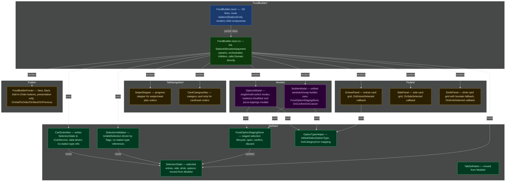

# Stations Refactoring Gameplan

## Current Architecture

The diagram below shows every file inside `Components/Pages/Stations/` and how they relate to one another. ⚠ marks classes that lock us into hard-coded station types and would need to change every time a new station is added.

```mermaid
%%{init: {'theme': 'dark'}}%%
graph TB
    classDef page     fill:#1a3a6e,stroke:#5588cc,color:#d0e8ff
    classDef cb       fill:#0d3a0d,stroke:#44aa44,color:#ccffcc
    classDef vm       fill:#3a2000,stroke:#cc8833,color:#ffe8bb
    classDef strategy fill:#2a0a4a,stroke:#8855cc,color:#eebbff
    classDef config   fill:#3a0a0a,stroke:#cc4444,color:#ffbbbb
    classDef model    fill:#003a3a,stroke:#33aaaa,color:#bbffff
    classDef factory  fill:#2a2a00,stroke:#aaaa33,color:#ffffbb

    subgraph gswipe["GenericSwipe/"]
        GS["GenericSwipe.razor — 847 lines, 5 station-specific blocks, 5 modals, 6 hard-coded routes"]:::page
        GSCS["GenericSwipe.razor.cs — 671 lines, duplicated sandwich/wrap staging, duplicated IsXxxComplete methods"]:::cb
        VM["GenericSwipeVM — delegates selection, validation, and cart logic to active ISelectionStrategy"]:::vm
        IVM["IGenericSwipeVM — view model interface"]:::vm
    end

    subgraph strats["Strategies/"]
        ISTR["ISelectionStrategy — 15-method interface"]:::strategy
        BASE["BaseSelectionStrategy — shared cart helpers and default option toggle methods"]:::strategy
        GRILL["GrillSelectionStrategy — entree, side, drink; no options"]:::strategy
        BF["BreakfastSelectionStrategy — loads options per entree, single-select per option type"]:::strategy
        PIZZA["PizzaSelectionStrategy — hard-coded MINIMUM_TOPPINGS=2, hard-coded FallbackToppings list"]:::strategy
        DELI["DeliSelectionStrategy — multi-select builder, hard-coded virtual entree at 6.99"]:::strategy
        WRAPS["WrapsSelectionStrategy — near-duplicate of Deli, hard-coded virtual entree at 6.99"]:::strategy
        FAC["SelectionStrategyFactory — switch on StationType, creates concrete strategy"]:::factory
        IFAC["ISelectionStrategyFactory — factory interface"]:::factory
    end

    subgraph cfg["Configuration/  [hard-coded — must change to add a station]"]
        STTYPE["StationType enum — Grill, Breakfast, Pizza, Deli, Wraps"]:::config
        STCONF["StationConfiguration — tabs, page title, flags, FallbackToppings, VirtualEntreeName"]:::config
        STPROV["StationConfigurationProvider — one hard-coded Create method per station type"]:::config
        ISTPROV["IStationConfigurationProvider — provider interface"]:::config
    end

    subgraph models["Models/"]
        SS["SelectionState — selected entree, side, drink, single/multi options, toppings"]:::model
        TD["TabDefinition — Id, DisplayName, IsDefault"]:::model
    end

    GS --> |partial class| GSCS
    GSCS --> |injects| IVM
    VM --> |implements| IVM
    VM --> |uses| IFAC
    VM --> |uses| ISTPROV
    VM --> |holds| SS
    FAC --> |implements| IFAC
    FAC --> |creates| ISTR
    GRILL --> |extends| BASE
    BF --> |extends| BASE
    PIZZA --> |extends| BASE
    DELI --> |extends| BASE
    WRAPS --> |extends| BASE
    BASE --> |implements| ISTR
    STPROV --> |implements| ISTPROV
    STPROV --> |creates| STCONF
    STCONF --> |contains| TD
    STCONF --> |references| STTYPE
```

---

## Ordered Refactoring Task List

### Phase 1 — Rename and Deduplicate (no architectural change)

1. **Rename `GenericSwipe` → `FoodBuilder` throughout the folder.** Move the `GenericSwipe/` folder to `FoodBuilder/`, rename every file inside it (`.razor`, `.razor.cs`, `.razor.css`, `VM.cs`, interface), and update namespaces and DI registrations. This aligns the file names with the end-goal before any other changes land.

2. **Merge `IsSandwichComplete()` and `IsWrapComplete()` in `FoodBuilder.razor.cs` into one method.** These two methods are byte-for-byte identical — both iterate `VM.OptionTypes` and check `VM.State.MultiSelectOptions`. Collapse them into a single `IsBuilderEntreeComplete()` method that both the sandwich and wrap tabs call.

3. **Consolidate sandwich/wrap staging state into a single unified set of fields and methods.** Replace the parallel `_stagedSandwichSelections` / `_stagedWrapSelections` dictionaries and the six paired duplicate methods (`OpenXxxBuilderModal`, `CloseXxxBuilderModal`, `ToggleStagedXxxOption`, `SetStagedXxxOption`, `ConfirmXxxBuilder`) with one `_stagedBuilderSelections` dictionary and one unified set of four methods.

4. **Merge the sandwich builder modal and wrap builder modal markup into a single modal block in `FoodBuilder.razor`.** After step 3, the two near-identical modal `
` sections (one for Deli, one for Wraps) can be collapsed into one modal block controlled by a single `_showBuilderModal` flag, with a `_builderModalTitle` string variable for the heading.

5. **Merge `DeliSelectionStrategy` and `WrapsSelectionStrategy` into a single `OptionBuilderSelectionStrategy`.** The two classes share every method with minor differences in entree name-matching strings (`"Sandwich"/"Deli"` vs `"Wrap"`). Parameterize the entree name predicate (`Func<EntreeDto, bool>`) and virtual entree name during construction, then delete both concrete classes and update `SelectionStrategyFactory`.

6. **Move `IsMultiSelectOptionType` logic into a standalone helper.** The method currently lives awkwardly in `GenericSwipeVM` and requires a `DeliSelectionStrategy` type-check. Extract it into a `Domain/OptionTypeHelper.cs` static class that takes a `FoodOptionTypeWithOptionsDto` and returns a bool based purely on `MaxAmount` and `FoodOptionTypeName` — no strategy reference needed.

---

### Phase 2 — Extract Domain Logic

7. **Create the `Domain/` subfolder and move `SelectionState` and `TabDefinition` into it.** Create `Stations/Domain/`, relocate `Models/SelectionState.cs` and `Models/TabDefinition.cs` into it, delete the now-empty `Models/` folder, and fix all using directives. These are pure data/logic objects and belong in a domain layer, not a `Models/` folder.

8. **Extract `SelectionValidator` into `Domain/`.** Pull `IsValidSelection` logic out of all strategy classes and into `Domain/SelectionValidator.cs`. The new class should accept a `SelectionState`, a list of option types, and boolean flags (`requiresEntree`, `requiresSide`, `requiresDrink`, `requiresOptionsComplete`) — with no reference to any station type string or enum.

9. **Extract `CartSubmitter` into `Domain/`.** Move the `AddToCartAsync` and all `AddXxxToCart` private methods from all strategy classes into `Domain/CartSubmitter.cs`. This class writes to `ICartService` based on the `SelectionState` and option type data it receives as parameters, containing zero branching on station type.

10. **Extract `FoodOptionStagingStore` into `Domain/`.** Move all staging dictionary fields and the open/confirm/discard lifecycle methods from `FoodBuilder.razor.cs` into `Domain/FoodOptionStagingStore.cs`. This makes the staged-selection workflow independently testable and gives the code-behind a clean, single-responsibility surface.

---

### Phase 3 — Extract Razor Components

11. **Extract `SwipeStepper` component.** Pull the progress-stepper markup (rendered for swipe/meal-plan orders) from `FoodBuilder.razor` into a new `TabNavigation/SwipeStepper/SwipeStepper.razor` component with its own code-behind and scoped CSS. It should accept a `List<TabDefinition>`, an active tab ID, and an `IsTabCompleted` callback parameter.

12. **Extract `CardCategoryNav` component.** Pull the category-card strip (rendered for card/cash orders) from `FoodBuilder.razor` into `TabNavigation/CardCategoryNav/CardCategoryNav.razor`. It should accept the same tab list and active tab, plus a selection-summary callback and icon-resolver callback, with an `OnTabSelected` EventCallback.

13. **Extract `EntreePanel` component.** Move the entree card-grid markup into `Panels/EntreePanel/EntreePanel.razor`, accepting an entrees list, the currently selected entree, a card-order flag, and an `OnEntreeSelected` EventCallback. Its code-behind should contain only the logic needed to render selection state visually.

14. **Extract `SidePanel` and `DrinkPanel` components.** Move the sides card-grid and the drinks card-grid (including the "fountain drink included" fallback) into their own `Panels/SidePanel/SidePanel.razor` and `Panels/DrinkPanel/DrinkPanel.razor` components, following the same parameter pattern used in step 13.

15. **Extract `BuilderModal` component.** Move the unified builder modal (from step 4) into `Modals/BuilderModal/BuilderModal.razor`. Its code-behind should use `FoodOptionStagingStore` to manage staged selections and expose `OnConfirm` and `OnCancel` EventCallbacks to the parent page — no staging state should remain in the parent's code-behind.

16. **Extract `OptionsModal` component.** Move the breakfast options modal and the pizza toppings modal into a single `Modals/OptionsModal/OptionsModal.razor` component that accepts option types, a `SingleSelectMode` bool, and `OnConfirm`/`OnCancel` EventCallbacks. This eliminates both `_showOptionsModal` and `_showPizzaToppingsModal` (and their staging fields) from the parent code-behind.

17. **Extract `FoodBuilderFooter` component.** Pull the footer bar markup into `Footer/FoodBuilderFooter.razor`. Its parameters should be the current tab, order mode (swipe vs card), and tab navigation state. It exposes `OnAddToOrder`, `OnNext`, and `OnPrevious` EventCallbacks; its code-behind determines button visibility only — no cart or selection logic.

---

### Phase 4 — Eliminate the Strategies and Configuration Folders

18. **Replace `StationType` and `StationConfigurationProvider` with database-driven station data.** Delete `Configuration/StationType.cs`, `Configuration/StationConfiguration.cs`, `Configuration/StationConfigurationProvider.cs`, and `Configuration/IStationConfigurationProvider.cs`. Instead, have `FoodBuilder.razor.cs` call the API to retrieve the station's entrees, sides, drinks, and option types; infer whether the station is "list" or "builder" style directly from whether option types are present in the data.

19. **Remove the `ISelectionStrategy` / `BaseSelectionStrategy` abstraction entirely.** Once `Domain/SelectionValidator.cs`, `Domain/CartSubmitter.cs`, and `Domain/FoodOptionStagingStore.cs` are in place, delete `Strategies/ISelectionStrategy.cs`, `Strategies/ISelectionStrategyFactory.cs`, `Strategies/BaseSelectionStrategy.cs`, `Strategies/SelectionStrategyFactory.cs`, and the remaining concrete strategy file. Update `FoodBuilder.razor.cs` to call the domain classes directly, and delete the now-unused `GenericSwipeVM`/`IGenericSwipeVM` pair.

---

### Phase 5 — Dynamic Routing from the Database

20. **Convert `FoodBuilder.razor` to a fully dynamic route and remove all hard-coded station routes.** Change the page directive to a single `@page "/station/{StationId:int}"`, removing the five hard-coded legacy routes (`/breakfast`, `/deli`, `/grill`, `/pizza`, `/wrap`). Update every navigation link in the app (station-select page, back URLs, post-order redirects) to build URLs from the station's database ID, completing the transition away from hard-coded station types.

---

## Target Architecture

The diagram below shows the `Components/Pages/Stations/` folder after all tasks above are complete. Stations are no longer enumerated in code; `FoodBuilder` loads any station dynamically from the API.

